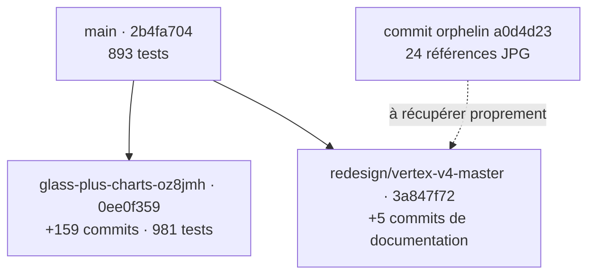

# VERTEX — Audit total du dépôt et préparation de Claude Code

> **Status: REFERENCE — état avant consolidation**
> Les recommandations de ce rapport ont été exécutées sur
> `integration/vertex-v4-clean`. Pour l'état courant, consulter
> `docs/vertex-v4/STATUS.md` et `docs/README.md`.

**Date :** 22 juillet 2026
**Dépôt :** `<owner>/Vertex-`
**Mode :** audit en lecture seule — aucun fichier, commit, branche ou pull request du dépôt n’a été modifié
**Objectif :** établir une vérité unique avant la refonte V4, remettre les fichiers et les branches en ordre, puis donner à Claude Code un environnement simple et sûr.

---

## 1. Verdict exécutif

Vertex est techniquement beaucoup plus solide que ne le laisse penser `main`, mais le dépôt est devenu difficile à comprendre parce que le travail récent est dispersé entre plusieurs branches, plusieurs systèmes de design et trop de documents qui se déclarent « canoniques ».

### Décision recommandée

**Ne pas lancer Claude Code sur `redesign/vertex-v4-master` dans son état actuel.**

La meilleure base technique est :

```text
glass-plus-charts-oz8jmh @ 0ee0f359
```

Cette branche :

- contient 159 commits absents de `main` ;
- ajoute 95 fichiers utiles ;
- passe **981 tests**, contre 893 sur `main` ;
- démarre correctement en mode démo ;
- sert les huit espaces principaux en HTTP 200 ;
- retourne zéro erreur dans `/api/client-log` ;
- contient les corrections récentes de sécurité, performance, routes, options, données et UI.

La stratégie la plus sûre est donc :

> **Base technique = dernière branche Glass vérifiée. Direction visuelle = V4 Obsidian Prism, après résolution explicite des contradictions.**

Il faut d’abord créer une branche d’intégration propre à partir de cette base, y réappliquer les cinq commits de documentation V4, récupérer correctement les 24 images de référence et consolider les instructions Claude. Seulement ensuite Claude Code pourra commencer le lot visuel 01.

### État de préparation

| Axe | État | Lecture |
|---|---:|---|
| Fonctionnement et tests | Fort | 981 tests verts sur la branche la plus avancée |
| Sécurité READONLY | Fort | Garde-fous présents et tests verts |
| Organisation Git | Faible | 13 branches, plusieurs vérités concurrentes |
| Documentation | Faible | 95 documents Markdown et plusieurs sources « canoniques » contradictoires |
| Design system | Bloqué | Black Glass, Obsidian Copper et Obsidian Prism se contredisent |
| Références visuelles | Bloqué | 24 images récupérables mais absentes des branches actives |
| Préparation Claude Code | 4/10 aujourd’hui | Peut atteindre 9/10 après le lot de consolidation |

---

## 2. Topologie réelle des branches



### Comparaison des trois bases actives

| Référence | Dernière activité | Fichiers | Écart face à `main` | Tests vérifiés | Conclusion |
|---|---:|---:|---:|---:|---|
| `main` | 15.07.2026 | 606 | référence actuelle | 893 passés, 2 ignorés | Stable, mais en retard |
| `glass-plus-charts-oz8jmh` | 21.07.2026 | 700 | +159 commits, 180 fichiers touchés, +13’154/−2’094 lignes | 981 passés, 2 ignorés | **Meilleure base technique** |
| `redesign/vertex-v4-master` | 22.07.2026 | 610 | +5 commits, documentation uniquement | code applicatif identique à `main` | Bon plan V4, mauvaise base technique |
| `a0d4d23` | 14.07.2026 | 24 JPG ajoutés | aucun ref distant actif ne le contient | n/a | Références récupérables mais invisibles |

Les deux tests ignorés sur la branche la plus avancée sont des cas honnêtes d’environnement hors ligne : aucun symbole scanné et board options vide.

### Répartition des 159 commits de la branche la plus avancée

| Type | Nombre |
|---|---:|
| `feat` | 100 |
| `fix` | 17 |
| `perf` | 12 |
| `docs` | 9 |
| `test` | 5 |
| `refactor` | 4 |
| autres | 12 |

Ce n’est donc pas une simple branche de couleur ou de thème. Elle contient des changements importants de performance, de fiabilité des données, de sécurité, d’options, de routes et de tests. Elle ne doit pas être fusionnée aveuglément dans `main`, mais elle ne doit surtout pas être ignorée.

### Pull requests

- Une seule PR est ouverte : la PR brouillon **#3**, « Plan complet + skills Claude Code pour la refonte Black Glass de Vertex ».
- Elle pointe vers `claude/vertex-glass-redesign-system`, contient un seul commit de documentation et repose sur l’ancien `main`.
- Elle est désormais dépassée par la branche Glass avancée et par la nouvelle intention V4.
- La branche `redesign/vertex-v4-master` n’a pas encore de PR dédiée.

**Recommandation :** ne fermer la PR #3 qu’après création d’une nouvelle branche d’intégration et d’une PR de remplacement clairement reliée.

---

## 3. Inventaire total des fichiers

L’inventaire joint couvre l’union de `main`, de la dernière branche Glass, de la branche V4 et du commit contenant les références visuelles.

### Résultat de l’union

| État | Nombre de chemins |
|---|---:|
| Identiques sur les trois branches actives | 521 |
| Différents entre les branches actives | 84 |
| Présents uniquement sur la branche Glass avancée | 95 |
| Présents uniquement sur V4 | 4 |
| Supprimé sur la branche Glass avancée mais présent sur `main`/V4 | 1 |
| Références visuelles orphelines | 24 |
| **Total inventorié** | **729** |

Les 84 chemins divergents incluent 69 fichiers applicatifs, 7 tests, `terminal.py`, `CLAUDE.md`, `.interface-design/system.md`, `company_cache.json` et quatre documents de design/routage. C’est la preuve qu’une refonte directement sur V4 travaillerait sur du code dépassé.

### Composition de la branche technique la plus avancée

| Type | Nombre |
|---|---:|
| Fichiers totaux | 700 |
| Python | 361 |
| JavaScript | 37 |
| CSS | 18 |
| Markdown | 138 |
| PNG | 122 |
| Polices WOFF2 | 8 |
| Fichiers de tests `test_*.py` | 86 |
| Fichiers sous `docs/` | 216 |
| Fichiers sous `.claude/` | 37 |

### Poids du dépôt de travail

| Zone | Taille approximative | Commentaire |
|---|---:|---|
| `docs/` | 20,6 Mo | 121 captures et 95 documents Markdown |
| `vertex/` | 2,6 Mo | code applicatif componentisé autour du monolithe |
| `company_cache.json` | 1,38 Mo | cache runtime pourtant suivi par Git |
| `terminal.py` | 1,24 Mo | 11’027 lignes |
| `tests/` | 397 Ko | suite de garde-fous riche |

L’inventaire CSV donne pour chaque chemin : catégorie, extension, taille, SHA du blob sur chaque branche, état de divergence et traitement recommandé.

---

## 4. Le dossier récent du nouveau thème

### Ce qui a été trouvé

Le commit suivant existe encore localement dans l’historique Git :

```text
a0d4d23a4b0be774f11bf61ca65ddd0c86c75ef8
Add files via upload
14.07.2026
```

Il ajoute :

```text
Nouveau dossier/
```

avec **24 images JPG**, pour environ **1,8 Mo**.

### Problème

Ce commit n’est contenu dans aucune branche distante active. Les images sont donc :

- absentes de `main` ;
- absentes de la branche Glass avancée ;
- absentes de `redesign/vertex-v4-master` ;
- invisibles pour Claude Code lorsqu’il ouvre une branche actuelle ;
- récupérables tant que le commit `a0d4d23` reste disponible.

### Qualité actuelle du dossier

- Les noms sont des hashes illisibles.
- Aucun fichier n’est désigné comme référence principale.
- Il n’existe pas de manifeste expliquant ce qu’il faut reprendre de chaque image.
- Il n’existe pas de provenance, de source ou de note de droits d’utilisation.
- Les 24 directions ne sont pas homogènes : certaines sont cyan/bleu, d’autres violet, orange, vert ou graphite.
- La Master Spec V4 réclame pourtant une référence officielle unique.

### Traitement recommandé

Ne pas cherry-pick le dossier brut sous le nom `Nouveau dossier`.

Le récupérer dans une branche de consolidation sous :

```text
docs/vertex-v4/reference/
├── 00-master-reference.jpg
├── 01-layout-density.jpg
├── 02-chart-language.jpg
├── 03-sidebar-shell.jpg
├── ...
├── CONTACT_SHEET.jpg
└── README.md
```

Le `README.md` doit préciser pour chaque image :

- source ou origine ;
- statut des droits ;
- élément à reprendre ;
- élément à éviter ;
- page Vertex concernée ;
- couleur, densité, navigation ou graphique inspiré ;
- statut `MASTER`, `SECONDARY` ou `REJECTED`.

Une planche contact des 24 références est jointe à cet audit.

---

## 5. Blocages critiques avant Claude Code

### B-01 — La branche V4 part de la mauvaise base

`redesign/vertex-v4-master` part de `main` au commit `2b4fa704`. Elle ne contient pas les 159 commits suivants, dont :

- déduplication de `/options/<sym>` et nouvelle API `/api/options/pack/<sym>` ;
- dossier options par titre ;
- corrections XSS et tests de sanitisation ;
- correction des clés de mémo ambiguës ;
- optimisation de `/api/ticker` d’environ 40 s à environ 3,2 s selon les mesures du projet ;
- tests de courses sur `scan_state` ;
- gestion honnête de l’absence OI/volume ;
- composants `VX.tile` ;
- polices auto-hébergées ;
- nouveaux graphiques et garde-fous.

**Impact :** Claude modifierait des pages et des contrats déjà corrigés ailleurs, puis créerait un conflit massif au moment de réunir les branches.

### B-02 — Trois systèmes de design se déclarent vérité

| Sujet | Branche Glass avancée | `.interface-design/system.md` sur V4 | Master Spec V4 |
|---|---|---|---|
| Identité | Black Glass Institutional | Obsidian Copper Institutional | Obsidian Prism |
| Marque | argent / graphite | cuivre / orange | violet / magenta / corail |
| Violet | options uniquement | options | marque, sélection et série principale |
| Bleu | zéro bleu identitaire | zéro bleu identitaire | bleu secondaire autorisé |
| Typographie | General Sans + JetBrains Mono réellement installées | Inter + SFMono/JetBrains | Inter + IBM Plex Mono/SFMono |
| Navigation | 8 espaces | 8 espaces | 9 espaces |
| Marchés | fusionné dans Dashboard ; `markets_page.py` supprimé | architecture 8 espaces | espace Marchés séparé |

La branche V4 se contredit même en interne : `.interface-design/system.md` dit « cuivre/orange » tandis que `docs/vertex-v4/VERTEX_V4_MASTER_SPEC.md` dit « violet/magenta/corail ».

**Décision à figer avant le code :**

1. Obsidian Prism devient-il la nouvelle vérité qui remplace Black Glass ?
2. Le violet devient-il la couleur de marque ou reste-t-il réservé aux options ?
3. Garde-t-on General Sans/JetBrains déjà auto-hébergées, ou revient-on à Inter/IBM Plex ?
4. Vertex conserve-t-il 8 espaces, ou Marchés redevient-il une page séparée ?

### B-03 — La référence officielle est absente

La V4 Spec indique que l’image exacte doit être fournie à Claude Code, mais aucune image n’est présente sous `docs/vertex-v4/reference/`. Claude serait obligé d’interpréter une direction générique et produirait probablement une quatrième variante visuelle.

### B-04 — La CI ne couvre pas les branches de refonte lors des pushes

Le workflow GitHub Actions surveille les pushes sur :

```yaml
main
claude/**
foundation/**
```

Il ne couvre pas :

```text
redesign/**
glass-plus-charts*
feature/**
integration/**
```

Une pull request déclenche la CI, mais un commit direct sur `redesign/vertex-v4-master` peut rester sans vérification automatique.

**Action :** ajouter les branches d’intégration aux filtres ou rendre obligatoire le passage par PR.

---

## 6. Problèmes importants de rangement

### H-01 — Deux fichiers runtime sont suivis par Git

#### `company_cache.json`

- 1,38 Mo ;
- 518 entrées ;
- explicitement couvert par `*_cache.json` dans `.gitignore` ;
- pourtant déjà suivi par Git, donc l’ignore ne s’applique plus ;
- a été rafraîchi dans un commit dédié, créant du bruit et des diffs inutiles.

**Traitement :** le retirer de l’index Git, conserver sa génération automatique et éventuellement fournir un petit fixture de test séparé.

#### `position_inventory.json`

- fichier runtime avec timestamp et un identifiant enregistré ;
- suivi par Git ;
- pas couvert par `.gitignore` ;
- risque futur de publier des informations liées aux positions, même si le contenu actuel est petit.

**Traitement :** ajouter une règle d’ignore, retirer le fichier du suivi et fournir un exemple anonyme si nécessaire.

### H-02 — Documentation trop volumineuse et contradictoire

La branche avancée contient :

- 95 documents Markdown sous `docs/` ;
- 121 captures sous `docs/redesign/` ;
- environ 20,3 Mo d’images ;
- de nombreux fichiers nommés `AUDIT`, `BASELINE`, `ULTIMATE`, `MASTER`, `IMPLEMENTATION`, `VERIFICATION` ;
- plusieurs documents anciens qui continuent d’affirmer être canoniques.

Claude Code peut retrouver un document obsolète avant le bon document et suivre une ancienne palette, une ancienne route ou une ancienne architecture.

**Traitement :** un index canonique, des statuts explicites et une archive versionnée.

### H-03 — Trop de commandes Claude concurrentes

Sur la branche avancée :

- 15 skills ;
- 6 agents ;
- 3 rules ;
- 37 fichiers sous `.claude/`.

Sur la branche V4 :

- 1 skill ;
- 0 agent ;
- 0 rule ;
- donc les bons garde-fous de sécurité, données et édition sûre ne sont pas repris.

**Cible :**

- un seul skill actif `vertex-v4-redesign` ;
- trois règles actives : sécurité/READONLY, intégrité des données, design V4 ;
- les instructions par page deviennent des références du skill, pas 14 commandes séparées ;
- les agents spécialisés peuvent rester, mais uniquement comme auditeurs appelés par l’orchestrateur ;
- `CLAUDE.md` reste court et route vers ces fichiers.

### H-04 — Les documents d’entrée sont périmés

- `README.md` présente encore 57 leaders et les anciennes routes `/titre`, `/entreprises`, `/watchlist`.
- `DEMARRER_ICI.md` demande d’ouvrir le dossier `IBKT-DASHBORD-` et décrit l’ancienne navigation Overview/Matinal/Comité/Recherche/Décisions/Santé.
- `CLAUDE.md` de la branche Glass indique encore de travailler sur `vertex-system-launch`, une branche ancienne déjà absorbée.

Ces trois fichiers sont précisément ceux qu’un humain ou Claude lit en premier.

### H-05 — Dette du monolithe et des styles

- `terminal.py` : 11’027 lignes et 1,24 Mo ;
- pages Python très grandes : `briefing.py` 1’826 lignes, `opportunities_page.py` 1’327, `analysis_page.py` 1’295 ;
- 18 feuilles CSS ;
- 4’061 attributs `style="..."` et 45 blocs `<style>` dans `terminal.py` + `vertex/ui` ;
- 126 littéraux hex dans le CSS et des milliers dans les chaînes Python/JS ;
- le strangler pattern existe mais n’est pas terminé.

**Conséquence :** une refonte globale d’un coup créerait des collisions de cascade et des régressions difficiles à localiser.

**Traitement :** migration progressive. Ne pas déplacer `terminal.py` maintenant. Extraire page, route ou composant uniquement quand ses consommateurs et ses tests sont identifiés.

### H-06 — Dépendances reproductibles seulement partiellement

Le dépôt utilise `requirements.txt` avec plusieurs bornes larges et ne contient pas de lockfile ni de `pyproject.toml`. L’installation a fonctionné pendant l’audit, mais un futur Claude Code peut recevoir une version majeure différente de Flask, yfinance, ib_async ou anthropic.

**Traitement ultérieur :** séparer runtime/dev et générer un verrou testé, sans bloquer le lot de consolidation V4.

---

## 7. Ce qui est déjà sain et doit être préservé

- Invariant absolu `READONLY=True`.
- Connexions IBKR en lecture seule.
- Suite de tests très riche : 981 tests passés sur la meilleure branche.
- Garde-fous dédiés à l’absence de chemin d’ordre.
- Donnée manquante affichée comme absente plutôt que fabriquée dans les chemins récents.
- Sanitisation des news externes couverte par test.
- `scan_state` muté en place et couvert contre les courses.
- Contrats de graphiques, provenance et statuts honnêtes déjà largement documentés.
- Huit espaces principaux fonctionnels.
- Démarrage démo vérifié ; les huit routes principales répondent en 200.
- `/api/client-log` retourne zéro erreur lors du contrôle de démarrage.
- Aucun préfixe courant de clé API, token GitHub/AWS ou clé privée détecté dans les fichiers actifs examinés.
- Dépôt Git cohérent : `git diff --check` et contrôle d’intégrité sans erreur sur la branche auditée.

La priorité n’est donc pas de reconstruire Vertex. Il faut préserver le travail existant, choisir une base, retirer le bruit et rendre la vérité explicite.

---

## 8. Architecture documentaire et Claude cible

```text
Vertex-/
├── CLAUDE.md                         # routeur court : invariants + documents obligatoires
├── README.md                         # produit actuel + routes actuelles
├── DEMARRER_ICI.md                   # démarrage utilisateur réellement à jour
├── terminal.py                       # conservé temporairement, extraction progressive
├── vertex/                           # code applicatif canonique
├── tests/                            # tous les garde-fous
├── tradingview/                      # intégration TradingView
├── scripts/
│   └── diagnostics/
│       ├── ib_reader.py
│       └── test_connection.py
├── .claude/
│   ├── launch.json
│   ├── rules/
│   │   ├── readonly-and-security.md
│   │   ├── data-integrity.md
│   │   └── design-v4.md
│   ├── agents/                       # auditeurs spécialisés, si conservés
│   └── skills/
│       └── vertex-v4-redesign/
│           ├── SKILL.md
│           ├── references/
│           └── templates/
└── docs/
    ├── README.md                     # index : ACTIVE / REFERENCE / ARCHIVE
    ├── canonical/
    │   ├── PRODUCT.md
    │   ├── ARCHITECTURE.md
    │   ├── READONLY.md
    │   ├── DATA_CONTRACT.md
    │   └── CHART_CONTRACT.md
    ├── vertex-v4/
    │   ├── VERTEX_V4_MASTER_SPEC.md
    │   ├── STATUS.md
    │   ├── DECISIONS.md
    │   ├── reference/
    │   └── captures/
    ├── audits/
    │   └── current/
    └── archive/
        ├── v1-v2/
        ├── v3/
        └── superseded-audits/
```

### Règles de documentation

Chaque document doit avoir en tête :

```text
Status: ACTIVE | REFERENCE | SUPERSEDED | ARCHIVED
Owner: ...
Last verified against commit: ...
Supersedes: ...
Superseded by: ...
```

Un seul fichier par sujet peut être `ACTIVE`.

---

## 9. Plan de consolidation recommandé

### Lot 0A — Sauvegarder sans rien perdre

1. Créer des tags annotés sur :
   - `main@2b4fa704` ;
   - `glass-plus-charts-oz8jmh@0ee0f359` ;
   - `redesign/vertex-v4-master@3a847f72` ;
   - le commit de références `a0d4d23`.
2. Ne supprimer aucune branche avant ces tags.
3. Exporter la liste des branches et le rapport de divergence.

### Lot 0B — Créer une vérité technique unique

1. Créer une nouvelle branche, par exemple :

   ```text
   integration/vertex-v4-clean
   ```

2. La créer depuis `0ee0f359`.
3. Réappliquer proprement les cinq commits V4 ou leur contenu, sans force-push destructif.
4. Résoudre `CLAUDE.md` en gardant les règles de sécurité de la branche avancée et le workflow V4.
5. Ne pas toucher à `main`.

### Lot 0C — Figer le design avant toute implémentation

1. Récupérer les 24 images depuis `a0d4d23`.
2. Les renommer et créer le manifeste.
3. Désigner une seule référence `MASTER`.
4. Trancher les quatre conflits : marque, violet, typographie, nombre d’espaces.
5. Mettre à jour ensemble :
   - `docs/vertex-v4/VERTEX_V4_MASTER_SPEC.md` ;
   - `.interface-design/system.md` ;
   - `.claude/rules/design-v4.md` ;
   - les tokens de référence, sans encore changer le runtime.

### Lot 0D — Simplifier Claude Code

1. Fusionner les 14 skills page-par-page en références du skill V4.
2. Reprendre les trois rules utiles de `vertex-maximum`.
3. Conserver les agents spécialisés seulement comme auditeurs.
4. Corriger l’ordre obligatoire : audit → plan → lot unique → tests → navigateur → revue → validation.
5. Interdire explicitement les commits directs sur la branche d’intégration.

### Lot 0E — Nettoyer le dépôt sans toucher au produit

1. Retirer `company_cache.json` et `position_inventory.json` du suivi Git ; vérifier leur génération runtime.
2. Mettre `.gitignore` à jour.
3. Ajouter `redesign/**` et `integration/**` à la CI, ou imposer une PR pour tout lot.
4. Créer `docs/README.md` et déplacer les documents obsolètes sous `docs/archive/` avec table de correspondance.
5. Mettre `README.md`, `DEMARRER_ICI.md` et `CLAUDE.md` à jour.
6. Ne pas supprimer les captures avant confirmation qu’elles sont archivées ailleurs.

### Lot 0F — Prouver la nouvelle base

1. `python -m pytest tests/ -q` : cible minimale **981 passés**.
2. Démarrer avec `DEMO=1 NO_IBKR=1`.
3. Vérifier `/healthz`.
4. Vérifier `/api/client-log` = 0.
5. Vérifier les huit espaces en HTTP 200.
6. Faire des captures desktop/tablette/mobile de la baseline.
7. Ouvrir une PR vers la branche d’intégration, jamais directement vers `main`.

### Ensuite seulement — V4 lots 01 à 16

Commencer les fondations, puis shell, composants, graphiques et pages. Un lot à la fois, avec arrêt pour validation visuelle.

---

## 10. Choix possibles

| Option | Description | Avantages | Risques | Verdict |
|---|---|---|---|---|
| **A — recommandée** | Partir de la dernière branche Glass, ajouter V4 comme nouvelle couche de design | Conserve 159 commits, 88 tests supplémentaires et les corrections récentes | Demande un lot initial de consolidation | **Choisir** |
| B | Repartir de `main` et cherry-pick sélectivement 159 commits | Historique potentiellement plus propre | Très long, risque élevé d’oublier une correction ou un test | Éviter sauf audit commit par commit |
| C | Continuer immédiatement sur `redesign/vertex-v4-master` | Rapide au premier jour | Refait du travail, manque 95 fichiers, conflits futurs massifs | **Rejeter** |

---

## 11. Branches : traitement proposé après consolidation

### Contenues dans la branche Glass avancée

Ces branches peuvent être archivées ou supprimées après création des tags et validation de la nouvelle branche :

- `claude/vertex-connection-setup-4j3h4j`
- `claude/vertex-latest-screenshots-0tuja0`
- `claude/vertex-strategy-os-h17dso`
- `claude/vertex-system-launch-0bsizs`
- `claude/vertex-visual-rebuild-1ofi8r`
- `feature/vertex-hyper-visual-intelligence`
- `glass-plus-charts`
- `integration/vertex-visual-merge`

### À traiter séparément

- `claude/vertex-glass-redesign-system` : PR #3 et ancien programme Black Glass ; comparer puis fermer comme remplacé.
- `claude/vertex-improvements-kybc4p` : un ancien patch de graphique interactif ; vraisemblablement dépassé, mais comparaison fonctionnelle nécessaire avant archive.
- `redesign/vertex-v4-master` : conserver comme source des cinq commits V4 jusqu’à leur réapplication sur la bonne base.
- `a0d4d23` : protéger par tag jusqu’à récupération des références.

---

## 12. Preuves de vérification

### Tests

```text
main
893 passed, 2 skipped in 44.89s

glass-plus-charts-oz8jmh
981 passed, 2 skipped in 81.34s
```

### Démarrage de la branche avancée

```text
Mode : DEMO=1, NO_IBKR=1
/healthz : status ok
/api/client-log : 0 erreur
```

Routes contrôlées :

| Route | Statut |
|---|---:|
| `/` | 200 |
| `/opportunities` | 200 |
| `/portfolio` | 200 |
| `/analysis` | 200 |
| `/options` | 200 |
| `/performance` | 200 |
| `/intelligence` | 200 |
| `/system` | 200 |

### Sécurité et intégrité

- Aucun secret évident détecté dans l’arbre actif avec les signatures courantes testées.
- Aucun header de clé privée détecté.
- `.env.example` contient des exemples et variables, pas une clé active détectée.
- `git diff --check` : OK.
- Contrôle d’intégrité Git de la branche avancée : OK.

---

## 13. Conclusion

Vertex n’a pas besoin d’une nouvelle reconstruction. Il a besoin d’une **consolidation unique et disciplinée**.

Le dépôt contient déjà une application mature, un système de tests exceptionnellement riche et beaucoup de travail utile. Le danger principal n’est pas le manque de code : c’est que Claude Code travaille sur la mauvaise branche, suive la mauvaise palette ou réimplémente des corrections déjà faites.

La prochaine action raisonnable est le **Lot 0 de consolidation**, sans refonte visuelle et sans modification de `main`. Une fois cette base prouvée, la V4 pourra être exécutée page par page avec une référence officielle, un seul design system et une seule instruction Claude.

---

## Artifacts associés

- `Vertex_File_Inventory_2026-07-22.csv` — inventaire des 729 chemins.
- `Vertex_Theme_References_Contact_Sheet_2026-07-22.jpg` — planche des 24 références récupérées.
